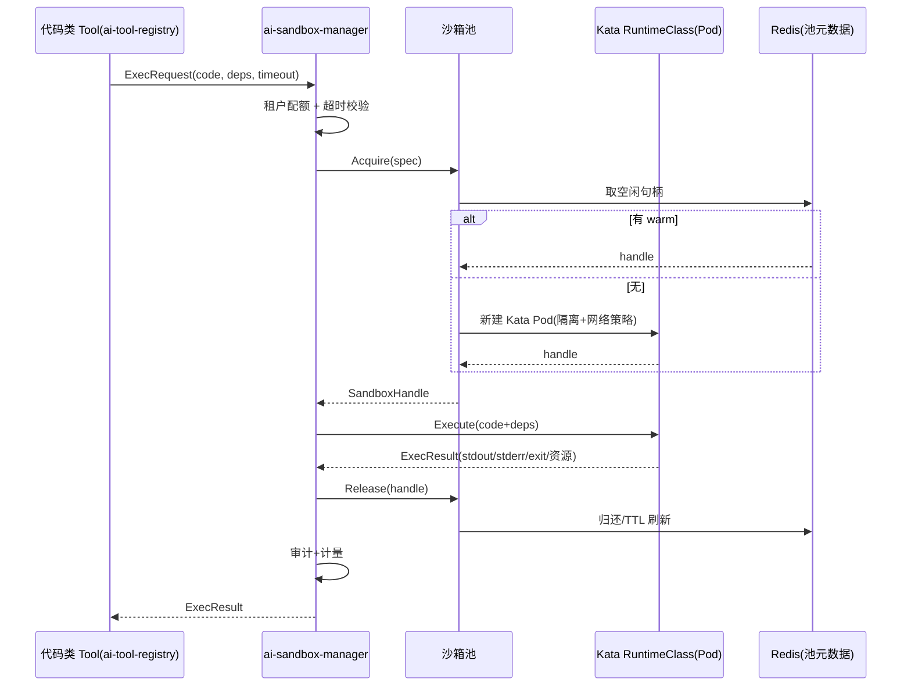

# ai-sandbox-manager · 详细设计

> **repo**: ai-sandbox-manager
> **语言·框架**: Go · Gin + Cobra + Wire（DDD 四层；沙箱池/调度热路径可上 Hertz/go-zero）
> **领域**: agent-infra（Agent 基础设施层 · 沙箱执行环境）
> **optional**: true（可选 · optional，默认关；仅允许代码执行的 Agent 需要）
> **平台版本**: v1.4.0
> **文档状态**: 草稿
> **负责人**: OpenStrata 架构组
> **关联链接**: 本仓 [arch/ARCH.md](../../arch/ARCH.md) · [skills/SKILLS.md](../../skills/SKILLS.md) · [specs/SPECS.md](../../specs/SPECS.md) ；架构设计文档 §4.3.3（沙箱执行环境）· §9.1（沙箱节点组）· §10.3（Sandbox SPI）· §10.4（SPI 多实现）· §10.6（Component Registry / Tool→SandboxExecutor）· §15.6（DDD 分层）· §16（BOM）

---

## 1. 定位与边界（Scope）

`ai-sandbox-manager` 是 OpenStrata 的**沙箱执行环境管理器**，承载 §4.3.3「沙箱执行环境」。它为 Agent 提供**隔离、受限、可回收**的代码执行环境，屏蔽底层 Kata Containers / E2B 的差异，对上层（Agent 运行时经 `ToolRegistry` 注册的代码类 Tool）暴露统一的 `Sandbox` SPI（§10.3）。

- **本仓解决的唯一问题**：把"代码在隔离环境里跑"这件危险的事，变成"声明式、带配额、带超时、可池化、可审计"的安全能力，且不绑定某一种沙箱实现（Kata / E2B 可并存切换）。
- **可选性**：optional，默认关（§10.2「沙箱执行 可选（默认关）」）。不允许代码执行的 Agent 无需本仓；阶段一~三 starter/standard 不启用（`profiles/optional_disabled` 含 `ai-sandbox-manager`、`kata-containers`、`e2b`），从 advanced 档起点亮。
- **与其他 Go 组件的分工**：
  - **vs ai-tool-registry**：代码类 Tool 经 `ai-tool-registry` 注册；运行时本仓作为 `SandboxExecutor` 承载其执行（§10.6 依赖规则 `Tool → SandboxExecutor`）。
  - **vs ai-gateway-core**：网关负责"模型调用"，不执行代码；二者数据面独立。
  - **vs ai-provisioning-engine**：本仓是被部署的 optional 组件之一；其 K8s RuntimeClass / E2B 凭证由装配引擎注入。

---

## 2. 职责清单

| # | 职责 | 必选/可选 | 说明 |
| --- | --- | --- | --- |
| R1 | 沙箱生命周期管理 | optional | 创建/执行/回收；池化复用（§4.3.3 POOL） |
| R2 | 隔离策略 | optional | VM/microVM 级隔离、网络隔离、资源限制（§4.3.3） |
| R3 | Kata 适配器 | optional | Kata Containers RuntimeClass（主力，§4.3.3） |
| R4 | E2B 适配器 | optional | E2B Firecracker microVM（备选，§4.3.3） |
| R5 | 配额/超时 | optional | CPU/Mem/GPU、执行超时、网络出网策略 |
| R6 | 依赖注入执行 | optional | 代码 + 依赖 + 超时 执行请求（§4.3.3 REQ） |
| R7 | 计量/审计 | optional | 执行次数、时长、资源消耗、结果（§4.8 审计） |

---

## 3. 核心抽象与接口（core interfaces / 类型定义）

领域层定义 `Sandbox` Port（bom.yaml `interface_versions.Sandbox = 1.0.0`）。

```go
package domain

// ===== Sandbox SPI（interface_versions.Sandbox = 1.0.0）=====
type Sandbox interface {
    // Acquire 从池中获取/新建一个空闲沙箱
    Acquire(ctx context.Context, spec SandboxSpec) (SandboxHandle, error)
    // Execute 在指定沙箱内执行代码，返回 stdout/stderr/退出码
    Execute(ctx context.Context, h SandboxHandle, req ExecRequest) (ExecResult, error)
    // Release 归还/销毁沙箱
    Release(ctx context.Context, h SandboxHandle) error
    // Health 探活
    Health(ctx context.Context) HealthStatus
}

type SandboxSpec struct {
    Runtime   string // kata | e2b（由 ProviderSelector 选，§10.4）
    CPU       string // 如 "1"
    Memory    string // 如 "512Mi"
    GPU       int    // 0 = 无；Kata 支持直通（§4.3.3）
    Network   NetworkPolicy // deny-all | allow-same-ns | egress-allowlist
    TimeoutMs int
    Image     string // 运行时镜像（Python/Node/Shell）
    TTL       int    // 空闲回收时间
}

type ExecRequest struct {
    Code     string            // 源码
    Language string            // python|node|shell
    Deps     []string          // pip/npm 依赖
    Args     []string
    Env      map[string]string
}

type ExecResult struct {
    Stdout   string
    Stderr   string
    ExitCode int
    DurationMs int
    ResourceUsage ResourceUsage
}

type SandboxHandle struct {
    ID       string
    Runtime  string
    Endpoint string // 容器内执行代理地址
    LeasedAt int64
}

type ResourceUsage struct { CPUms int; MemBytes int; GPUms int }
```

---

## 4. 处理流水线 / 请求路径

代码执行请求路径（Agent 经代码 Tool 触发）：

```mermaid
flowchart TD
    A[Agent / 代码类 Tool(经 ai-tool-registry)] -->|"ExecRequest"| B[ai-sandbox-manager 接入层]
    B --> C[配额/超时校验 + 租户上下文]
    C --> D[ProviderSelector: kata/e2b]
    D --> E[沙箱池: 取空闲 / 新建]
    E --> F[注入代码+依赖+网络策略]
    F --> G[执行代理运行代码]
    G --> H{超时/资源超限?}
    H -->|"是"| KILL[强制回收 + 记录]
    H -->|"否"| I[收集 stdout/stderr/退出码/资源]
    I --> J[审计 + 计量]
    J --> K[Release 归还/销毁沙箱]
    K --> R[返回 ExecResult]
```

---

## 5. 关键算法 / 逻辑

### 5.1 沙箱生命周期与池化
- 维护按 `SandboxSpec`（runtime/CPU/mem/image）分桶的**空闲池**；`Acquire` 优先复用 warm 沙箱（启动 ~1s Kata / ~150ms E2B，§4.3.3），无空闲则新建。
- `Release`：warm 沙箱归还池并刷新 TTL；TTL 到期或池上限触发销毁（tmpfs 清理）。
- 异常路径：执行超时/资源超限由看门狗强杀并回收，避免泄漏。

### 5.2 隔离策略
- **Kata（主力）**：VM 级隔离，K8s `RuntimeClass=kata`，`NetworkPolicy` 默认 `deny-all + allow-same-ns`（§4.7.1）；支持 GPU 直通（§4.3.3）。
- **E2B（备选）**：Firecracker microVM，经 E2B SDK 调用，无 GPU（§4.3.3）；适合纯代码、快速场景。
- 文件系统：临时 `tmpfs`，执行后清理；无持久化（除非显式挂载 PVC，optional）。

### 5.3 配额与网络
- 资源：K8s `ResourceQuota` / 容器 limits 约束 CPU/Mem/GPU。
- 网络：`deny-all` 默认；`egress-allowlist` 仅放行白名单域名（防止数据外泄 / 滥用）。

---

## 6. 与外部系统/组件的适配（OSS / SPI Adapter）

| SPI 端口 | 本仓角色 | 外部组件（bom.yaml） | 默认 ✅ / 备选 | Adapter |
| --- | --- | --- | --- | --- |
| `Sandbox` (1.0.0) | 实现方 | Kata Containers（optional, 备选）· E2B（optional, 备选） | 备选 / 备选 | `KataAdapter` / `E2BAdapter` |
| `Cache` (1.0.0) | 消费方 | Redis（core） | ✅ | 池元数据、配额计数 |
| `Auth` (1.0.0) | 消费方 | Keycloak（core） | ✅ | 租户身份 |
| `Tracing` (1.0.0) | 消费方 | Langfuse/OTel（optional/core） | ✅ | 执行链路追踪 |

> **同类多实现并存（§10.4）**：`Sandbox` SPI 背后 Kata 与 E2B 可并存；`ProviderSelector` 按租户/请求偏好 + 能力（GPU 需求→Kata）路由。切换零改动（防腐层隔离）。
> **阶段引入**：Kata/E2B 均为 optional，默认关（§10.2）；从 advanced 档点亮（profiles `optional_disabled` 移除）。
> **依赖**：执行代码的 Tool → `SandboxExecutor`（§10.6 依赖规则）；Kata 依赖 K8s RuntimeClass（§9.1 沙箱节点组）。

---

## 7. API / CLI / 配置接口面

### 7.1 HTTP API（Gin）
```
POST /v1/sandbox/acquire     # 获取沙箱
POST /v1/sandbox/{id}/exec   # 执行代码
POST /v1/sandbox/{id}/release# 归还/销毁
GET  /v1/sandbox/pool/stats  # 池状态
GET  /healthz  /metrics
```
### 7.2 CLI（可选，运维）
本仓不单独发布 CLI；`aictl` 可经控制面间接管理沙箱策略。运维用 `--config` 启动。
### 7.3 配置片段（本仓 `infrastructure/config/`）
```yaml
sandbox:
  pool:
    maxIdlePerSpec: 4
    ttlSeconds: 300
  defaults:
    runtime: kata            # 主力；e2b 为备选
    cpu: "1"
    memory: "512Mi"
    network: deny-all
    timeoutMs: 30000
  providers:
    kata:
      enabled: true
      runtimeClass: kata
    e2b:
      enabled: false         # optional 备选，默认关
      apiKeyFrom: vault://e2b
```

---

## 8. 数据模型与存储

- **轻持久化**：本仓以**运行时状态**为主，池元数据存 Redis（core）；执行结果/审计异步落 PostgreSQL（core，`audit_log`）。不长期存储用户代码（安全）。
- 可选：执行产物（artifact）落地 MinIO（optional），需显式开启且受租户隔离（§4.7.1 存储隔离）。

```sql
-- 仅记录审计/计量，不存代码体
CREATE TABLE sandbox_exec_audit (
  id          BIGSERIAL PRIMARY KEY,
  tenant_id   TEXT,
  runtime     TEXT,
  exit_code   INT,
  duration_ms INT,
  resource_usage JSONB,
  created_at  TIMESTAMPTZ DEFAULT now()
);
```

---

## 9. 并发与性能（goroutine / pool / 背压）

- **框架**：Gin 管理 API；池调度热路径可上 Hertz/go-zero（§15.6.1）。
- **池模型**：每 `SandboxSpec` 桶一个 `sync.Pool` 风格结构 + `chan SandboxHandle` 实现无锁取还；`Acquire`/`Release` 毫秒级。
- **Goroutine**：每个 `Execute` 一 goroutine + context 超时；看门狗 goroutine 监控超时/资源。
- **背压**：并发沙箱数受 `maxIdlePerSpec` + 节点 GPU/CPU 上限约束；超出时 `Acquire` 阻塞或返回 `429 繁忙`，保护节点。
- **资源限制**：容器 cgroups + K8s limits；GPU 经 device plugin 直通（仅 Kata）。
- **无状态控制面**：管理面无状态可水平扩；沙箱实例随节点存在。

---

## 10. 关键时序图（Mermaid）



---

## 11. 配置与部署（含 optional 组件启停、K8s 资源/探针）

- **部署形态**：optional，默认不部署；从 advanced 档点亮（§9.1 沙箱节点组 `KATA_N`；§12.2）。standard/starter 在 `optional_disabled` 中。
- **K8s 资源**：部署于 `ai-system` 或租户命名空间；Kata 需节点装 `kata-containers` RuntimeClass（§9.1）；E2B 仅需出口网络到 E2B 云（或自托管 E2B）。
  - 控制面 requests cpu 250m / mem 256Mi；limits cpu 1 / mem 1Gi。
  - 沙箱 Pod 本身资源由 `SandboxSpec` 决定（CPU/Mem/GPU）。
- **探针**：存活 `GET /healthz`；就绪 `GET /healthz`（校验 Redis + 至少一个 provider healthy）。`initialDelaySeconds: 5`，period `10s`。
- **启停**：布尔开关 `sandbox.enabled`（PlatformManifest），关闭后代码类 Tool 直接返回「沙箱不可用」（§13.3 增量启停，零停机）。
- **滚动更新**：多副本管理面 + 探针（§13.3）；沙箱 Pod 不随管理面滚动。

---

## 12. 可观测性 / 安全

- **可观测性（§4.8）**：基础 OTel traces + 审计（core）；Prometheus（池利用率、Acquire/Execute QPS、执行时长、超时率、资源消耗）。
- **安全（§4.3.3 / §4.7.4）**：VM/microVM 级隔离；网络 `deny-all` + 出网白名单；资源硬限制防滥用；执行全量审计（core）；基础风控（限流）下沉 core。GPU 仅阶段四自托管场景可用（§11.2）。

---

## 13. 测试策略

- **单元测试**：池取还逻辑、配额/TTL、超时看门狗、ProviderSelector 路由（领域层纯逻辑，§15.6.5）。
- **SPI 契约测试**：Kata/E2B Adapter 跑同一契约（acquire→exec→release→资源统计），保证多实现一致（§10.4）。
- **集成测试**：起 Kata RuntimeClass（或 E2B 测试账号），验证隔离（进程/网络不可达宿主）、超时强杀、资源限制生效。
- **安全测试**：验证 `deny-all` 下无法出网、无法访问同 ns 外服务；验证代码不能逃逸到宿主。
- **压测**：warm 池命中率对 `Acquire` 延迟影响；高并发 `Execute` 下节点资源不 OOM、不雪崩（背压验证）。

---

## 14. 开放问题

1. **E2B 自托管 vs 云**：E2B 默认走云（商业），企业内网是否需自托管 E2B 控制面？影响 `egress` 合规（§4.4.6）。
2. **沙箱与多租户的隔离粒度**：沙箱 Pod 放 `ai-system` 共享还是每租户命名空间？涉及 `NetworkPolicy` 与配额模型（§4.7.1）。
3. **GPU 沙箱的调度**：Kata GPU 直通与 Kueue 多队列（§9.3）如何协同做租户级 GPU 配额？
4. **代码产物持久化**：是否允许将执行产物落 MinIO 并跨会话复用？需明确租户隔离与生命周期。
5. **与 `ai-provisioning-engine` 的 RuntimeClass 注入**：Kata RuntimeClass 的版本/参数由谁在装配期保证与 bom.yaml `kata-containers@3.12.0` 一致？

---

## 变更记录

| 版本 | 日期 | 作者 | 说明 |
| --- | --- | --- | --- |
| v0.1 | 2026-07-17 | OpenStrata 架构组 | 初稿（覆盖占位骨架，14 节完整） |

## 追溯矩阵（本文档章节 ↔ 架构设计文档 § 编号）

| 章节 | 对应架构 § |
| --- | --- |
| 1 定位与边界 | §4.3.3, §10.2, §12.2, §15.6 |
| 2 职责清单 | §4.3.3 |
| 3 核心抽象与接口 | §4.3.3, §10.3, §16 |
| 4 处理流水线 | §4.3.3 |
| 5 关键算法 | §4.3.3, §4.7.1, §10.6 |
| 6 外部适配 | §4.3.3, §10.4, §10.6, §16 |
| 7 API/CLI/配置 | §12 |
| 8 数据模型 | §4.7.1, §4.8, §16(base) |
| 9 并发与性能 | §4.3.3, §9.1, §15.6.1 |
| 10 时序图 | §4.3.3, §15.6.2.2 |
| 11 配置部署 | §9.1, §9.2, §12.2, §13.3 |
| 12 可观测性/安全 | §4.3.3, §4.7.4, §4.8 |
| 13 测试策略 | §4.3.3, §10.4, §15.6.5 |
| 14 开放问题 | §4.3.3, §4.4.6, §9.3, §10.6 |
