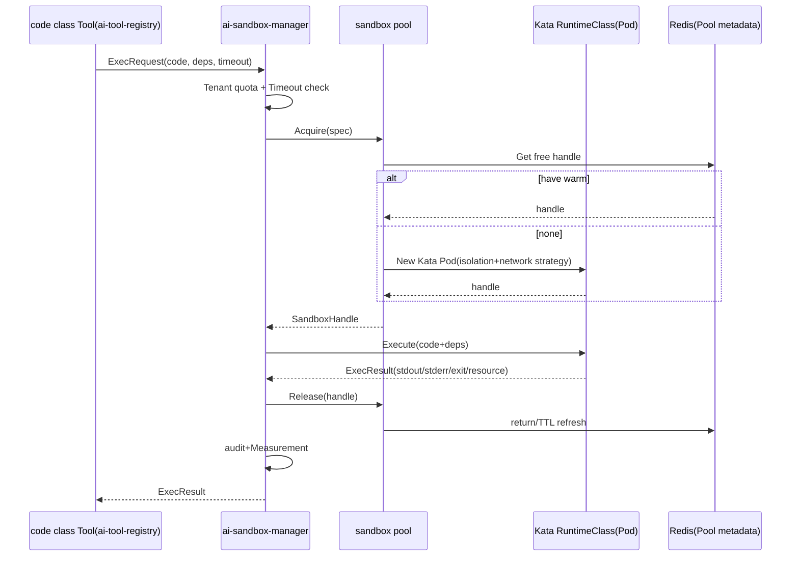

# ai-sandbox-manager · Detailed design

> **repo**: ai-sandbox-manager
> **Language · Framework**: Go · Gin + Cobra + Wire (DDD four layers; sandbox pool/scheduling hot path can be on Hertz/go-zero)
> **Domain**: agent-infra (Agent infrastructure layer · sandbox execution environment)
> **optional**: true (optional · optional, off by default; only required by Agents that allow code execution)
> **Platform version**: v1.0.0
> **Document Status**: Draft
> **Responsible Person**: OpenStrata Architecture Group
> **Associated links**: This repository [docs/ARCH.md](../../docs/ARCH.md) · [docs/SKILLS.md](../../docs/SKILLS.md) · [docs/SPECS.md](../../docs/SPECS.md); Architecture design document §4.3.3 (Sandbox execution environment) · §9.1 (Sandbox Node Group) · §10.3 (Sandbox SPI) · §10.4 (SPI Multiple Implementation) · §10.6 (Component Registry/Tool→SandboxExecutor) · §15.5 (DDD Layering) · §16 (BOM)

---

## 1. Positioning and Boundary (Scope)

`ai-sandbox-manager` is OpenStrata's **Sandbox Execution Environment Manager**, hosting §4.3.3 "Sandbox Execution Environment". It provides an isolated, restricted, recyclable code execution environment for the Agent, shields the differences between the underlying Kata Containers/E2B, and exposes a unified `Sandbox` SPI (§10.3) to the upper layer (the code class Tool registered with `ToolRegistry` when the Agent is running).

- **The only problem solved by this repository**: Turn the dangerous thing of "code running in an isolated environment" into a security capability of "declarative, with quotas, with timeouts, poolable, and auditable", and is not bound to a certain sandbox implementation (Kata / E2B can coexist and switch).
- **Optional**: optional, off by default (§10.2 "Sandbox execution optional (off by default)"). Agents that do not allow code execution do not need this repository; stages 1 to 3 starter/standard are not enabled (`profiles/optional_disabled` includes `ai-sandbox-manager`, `kata-containers`, `e2b`), and are lit from the advanced level.
- **Division of labor with other Go components**:
- **vs ai-tool-registry**: The code class Tool is registered with `ai-tool-registry`; at runtime, this repository serves as `SandboxExecutor` to host its execution (§10.6 Dependency rule `Tool → SandboxExecutor`).
- **vs ai-gateway-core**: The gateway is responsible for "model calling" and does not execute code; the two data planes are independent.
- **vs ai-provisioning-engine**: This repository is one of the deployed optional components; its K8s RuntimeClass / E2B credentials are injected by the assembly engine.

---

## 2. Responsibilities List

| # | Responsibilities | Required/Optional | Description |
| --- | --- | --- | --- |
| R1 | Sandbox life cycle management | optional | Creation/execution/recycling; pooled reuse (§4.3.3 POOL) |
| R2 | Isolation policy | optional | VM/microVM level isolation, network isolation, resource limits (§4.3.3) |
| R3 | Kata Adapter | optional | Kata Containers RuntimeClass (main, §4.3.3) |
| R4 | E2B Adapter | optional | E2B Firecracker microVM (optional, §4.3.3) |
| R5 | Quota/timeout | optional | CPU/Mem/GPU, execution timeout, network outbound policy |
| R6 | Dependency injection execution | optional | code + dependency + timeout execution request (§4.3.3 REQ) |
| R7 | Measurement/Audit | optional | Number of executions, duration, resource consumption, results (§4.8 Audit) |

---

## 3. Core abstraction and interface (core interfaces / type definition)

Domain layer definition `Sandbox` Port (bom.yaml `interface_versions.Sandbox = 1.0.0`).

```go
package domain

// ===== Sandbox SPI（interface_versions.Sandbox = 1.0.0）=====
type Sandbox interface {
    //Acquire Get/create a free sandbox from the pool
    Acquire(ctx context.Context, spec SandboxSpec) (SandboxHandle, error)
    //Execute executes code in the specified sandbox and returns stdout/stderr/exit code
    Execute(ctx context.Context, h SandboxHandle, req ExecRequest) (ExecResult, error)
    //Release returns/destroys the sandbox
    Release(ctx context.Context, h SandboxHandle) error
    //Health exploration
    Health(ctx context.Context) HealthStatus
}

type SandboxSpec struct {
    Runtime   string //kata | e2b (selected by ProviderSelector, §10.4)
    CPU       string //Such as "1"
    Memory    string //Such as "512Mi"
    GPU       int    //0 = None; Kata supports passthrough (§4.3.3)
    Network   NetworkPolicy // deny-all | allow-same-ns | egress-allowlist
    TimeoutMs int
    Image     string //Runtime image (Python/Node/Shell)
    TTL       int    //idle recovery time
}

type ExecRequest struct {
    Code     string            //Source code
    Language string            // python|node|shell
    Deps     []string          //pip/npm dependencies
    Args     []string
    Env      map[string]string
}

type ExecResult struct {
    Stdout   string
    Stderr   string
    ExitCode int
    DurationMs int
    ResourceUsage ResourceUsage
}

type SandboxHandle struct {
    ID       string
    Runtime  string
    Endpoint string //Execution proxy address in the container
    LeasedAt int64
}

type ResourceUsage struct { CPUms int; MemBytes int; GPUms int }
```

---

## 4. Processing pipeline/request path

Code execution request path (Agent is triggered by code Tool):

```mermaid
flowchart TD
    A[Agent / code class Tool(through ai-tool-registry)] -->|"ExecRequest"| B[ai-sandbox-manager access layer]
    B --> C[quota/Timeout check + Tenant context]
    C --> D[ProviderSelector: kata/e2b]
    D --> E[sandbox pool: take free / New]
    E --> F[Inject code+rely+network strategy]
    F --> G[Execute agent running code]
    G --> H{time out/Resource exceeded?}
    H -->|"yes"| KILL[Forced recycling + Record]
    H -->|"no"| I[collect stdout/stderr/exit code/resource]
    I --> J[audit + Measurement]
    J --> K[Release return/Destroy sandbox]
    K --> R[return ExecResult]
```

---

## 5. Key algorithm/logic

### 5.1 Sandbox life cycle and pooling
- Maintain the **idle pool** bucketed by `SandboxSpec` (runtime/CPU/mem/image); `Acquire` prioritizes reusing the warm sandbox (starting ~1s Kata / ~150ms E2B, §4.3.3), and creates a new one if there is no idle pool.
- `Release`: The warm sandbox returns the pool and refreshes the TTL; TTL expiration or pool limit triggers destruction (tmpfs cleanup).
- Exception paths: Execution timeouts/resource overruns are killed and recycled by watchdogs to avoid leaks.

### 5.2 Isolation strategy
- **Kata (main)**: VM-level isolation, K8s `RuntimeClass=kata`, `NetworkPolicy` defaults to `deny-all + allow-same-ns` (§4.7.1); supports GPU pass-through (§4.3.3).
- **E2B (alternative)**: Firecracker microVM, called by E2B SDK, without GPU (§4.3.3); suitable for pure code, fast scenarios.
- Filesystem: temporary `tmpfs`, clean after execution; no persistence (unless PVC is explicitly mounted, optional).

### 5.3 Quota and Network
- Resource: K8s `ResourceQuota` / container limits constraints CPU/Mem/GPU.
- Network: `deny-all` default; `egress-allowlist` only allows whitelist domain names (to prevent data leakage/abuse).

---

## 6. Adaptation with external systems/components (OSS/SPI Adapter)

| SPI port | Role of this repository | External component (bom.yaml) | Default ✅ / Alternative | Adapter |
| --- | --- | --- | --- | --- |
| `Sandbox` (1.0.0) | Implementer | Kata Containers (optional, alternative) · E2B (optional, alternative) | alternative / alternative | `KataAdapter` / `E2BAdapter` |
| `Cache` (1.0.0) | Consumer | Redis (core) | ✅ | Pool metadata, quota count |
| `Auth` (1.0.0) | Consumer | Keycloak (core) | ✅ | Tenant Identity |
| `Tracing` (1.0.0) | Consumer | Langfuse/OTel (optional/core) | ✅ | Execute link tracking |

> **Multiple implementations of the same type coexist (§10.4)**: Kata and E2B behind `Sandbox` SPI can coexist; `ProviderSelector` is routed according to tenant/request preference + capability (GPU demand→Kata). Switch zero modification (anti-corrosion layer isolation).
> **Introduced in stage**: Kata/E2B are optional, off by default (§10.2); turned on from advanced (profiles `optional_disabled` removed).
> **Dependencies**: Tool for executing code → `SandboxExecutor` (§10.6 Dependency rules); Kata depends on K8s RuntimeClass (§9.1 Sandbox node group).

---

## 7. API / CLI / Configuration interface

### 7.1 HTTP API（Gin）
```
POST /v1/sandbox/acquire     #Get sandbox
POST /v1/sandbox/{id}/exec   #Execute code
POST /v1/sandbox/{id}/release# return/destroy
GET  /v1/sandbox/pool/stats  #pool status
GET  /healthz  /metrics
```
### 7.2 CLI (optional, operation and maintenance)
This repository does not publish a separate CLI; `aictl` can indirectly manage sandbox policies through the control plane. Operation and maintenance is started with `--config`.
### 7.3 Configuration fragment (this repository `infrastructure/config/`)
```yaml
sandbox:
  pool:
    maxIdlePerSpec: 4
    ttlSeconds: 300
  defaults:
    runtime: kata            #The main force; e2b is the alternative
    cpu: "1"
    memory: "512Mi"
    network: deny-all
    timeoutMs: 30000
  providers:
    kata:
      enabled: true
      runtimeClass: kata
    e2b:
      enabled: false         #optional alternative, default off
      apiKeyFrom: vault://e2b
```

---

## 8. Data model and storage

- **Light persistence**: This repository is mainly based on **runtime status**, and the pool metadata is stored in Redis (core); execution results/auditing are asynchronously logged into PostgreSQL (core, `audit_log`). User code is not stored long term (security).
- Optional: The execution artifact is implemented in MinIO (optional), which needs to be explicitly enabled and subject to tenant isolation (§4.7.1 Storage isolation).

```sql
-- Log audit only/Measurement，No code body saved
CREATE TABLE sandbox_exec_audit (
  id          BIGSERIAL PRIMARY KEY,
  tenant_id   TEXT,
  runtime     TEXT,
  exit_code   INT,
  duration_ms INT,
  resource_usage JSONB,
  created_at  TIMESTAMPTZ DEFAULT now()
);
```

---

## 9. Concurrency and performance (goroutine / pool / back pressure)

- **Framework**: Gin management API; pool scheduling hot path can be on Hertz/go-zero (§15.5.1).
- **Pool model**: One `sync.Pool` style structure per `SandboxSpec` bucket + `chan SandboxHandle` to achieve lock-free retrieval; `Acquire`/`Release` millisecond level.
- **Goroutine**: One goroutine + context timeout per `Execute`; watchdog goroutine monitors timeouts/resources.
- **Backpressure**: The number of concurrent sandboxes is limited by `maxIdlePerSpec` + the node GPU/CPU upper limit; when exceeded, `Acquire` blocks or returns `429 Busy` to protect the node.
- **Resource Limits**: Container cgroups + K8s limits; GPU pass-through via device plugin (Kata only).
- **Stateless control plane**: The management plane is stateless and can be expanded horizontally; sandbox instances exist with nodes.

---

## 10. Key sequence diagram (Mermaid)



---

## 11. Configuration and deployment (including optional component start and stop, K8s resources/probes)

- **Deployment mode**: optional, not deployed by default; lit from advanced mode (§9.1 Sandbox node group `KATA_N`; §12.2). standard/starter in `optional_disabled`.
- **K8s resources**: deployed in `ai-system` or tenant namespace; Kata requires node installation of `kata-containers` RuntimeClass (§9.1); E2B only needs to export the network to the E2B cloud (or self-hosted E2B).
- Control plane requests cpu 250m / mem 256Mi; limits cpu 1 / mem 1Gi.
- The resources of the sandbox Pod itself are determined by `SandboxSpec` (CPU/Mem/GPU).
- **Probe**: alive `GET /healthz`; ready `GET /healthz` (verify Redis + at least one provider healthy). `initialDelaySeconds: 5`, period `10s`.
- **Start and stop**: Boolean switch `sandbox.enabled` (PlatformManifest). After closing, the code class Tool directly returns "Sandbox is not available" (§13.3 Incremental start and stop, zero downtime).
- **Rolling Update**: Multi-copy management plane + probe (§13.3); sandbox Pods do not roll with the management plane.

---

## 12. Observability / Security

- **Observability (§4.8)**: Basic OTel traces + auditing (core); Prometheus (pool utilization, Acquire/Execute QPS, execution duration, timeout rate, resource consumption).
- **Security (§4.3.3 / §4.7.4)**: VM/microVM level isolation; network `deny-all` + outgoing network whitelist; resource hard limit to prevent abuse; perform full audit (core); basic risk control (rate limiting) is moved to core. GPU is only available in stage four self-hosted scenarios (§11.2).

---

## 13. Testing strategy

- **Unit test**: pool withdrawal logic, quota/TTL, timeout watchdog, ProviderSelector routing (domain layer pure logic, §15.5.5).
- **SPI contract test**: Kata/E2B Adapter runs the same contract (acquire→exec→release→resource statistics) to ensure consistency among multiple implementations (§10.4).
- **Integration Test**: Start Kata RuntimeClass (or E2B test account), verify isolation (process/network unreachable host), timeout kill, and resource restrictions take effect.
- **Security test**: Verify that under `deny-all`, it cannot go out of the network and cannot access services outside the same ns; the verification code cannot escape to the host.
- **Stress Test**: The impact of warm pool hit rate on `Acquire` delay; node resources under high concurrency `Execute` will not OOM or avalanche (back pressure verification).

---

## 14. Open questions

1. **E2B self-hosting vs. cloud**: E2B uses the cloud (commercial) by default. Does the enterprise intranet need to self-host the E2B control plane? Affects `egress` compliance (§4.4.6).
2. **Isolation granularity of sandbox and multi-tenant**: Should the sandbox Pod be placed in the `ai-system` shared or per-tenant namespace? Relates to `NetworkPolicy` and the quota model (§4.7.1).
3. **GPU Sandbox Scheduling**: How do Kata GPU passthrough and Kueue multi-queue (§9.3) work together to create tenant-level GPU quotas?
4. **Code product persistence**: Is it allowed to drop execution products into MinIO and reuse them across sessions? Tenant isolation and life cycle need to be clarified.
5. **RuntimeClass injection with `ai-provisioning-engine`**: Who ensures that the version/parameters of Kata RuntimeClass are consistent with bom.yaml `kata-containers@3.12.0` during assembly?

---

## Change record

| Version | Date | Author | Description |
| --- | --- | --- | --- |
| v0.1 | 2026-07-17 | OpenStrata Architecture Group | First draft (covering the placeholder skeleton, complete with 14 sections) |

## Traceability Matrix (Chapter of this document ↔ Architecture Design Document § Number)

| Chapter | Corresponding Architecture § |
| --- | --- |
| 1 Positioning and Boundaries | §4.3.3, §10.2, §12.2, §15.5 |
| 2 Responsibilities List | §4.3.3 |
| 3 Core abstractions and interfaces | §4.3.3, §10.3, §16 |
| 4 Processing Pipeline | §4.3.3 |
| 5 Key Algorithms | §4.3.3, §4.7.1, §10.6 |
| 6 External adaptation | §4.3.3, §10.4, §10.6, §16 |
| 7 API/CLI/Configuration | §12 |
| 8 Data Model | §4.7.1, §4.8, §16(base) |
| 9 Concurrency and Performance | §4.3.3, §9.1, §15.5.1 |
| 10 Timing diagram | §4.3.3, §15.5.2.2 |
| 11 Configuration Deployment | §9.1, §9.2, §12.2, §13.3 |
| 12 Observability/Security | §4.3.3, §4.7.4, §4.8 |
| 13 Testing Strategy | §4.3.3, §10.4, §15.5.5 |
| 14 Open Questions | §4.3.3, §4.4.6, §9.3, §10.6 |
